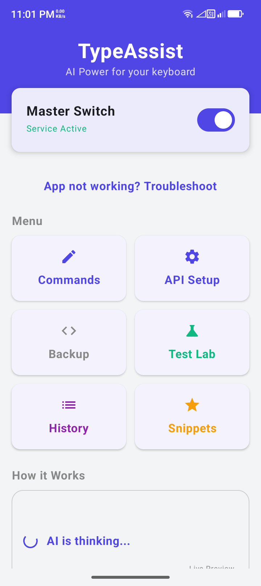
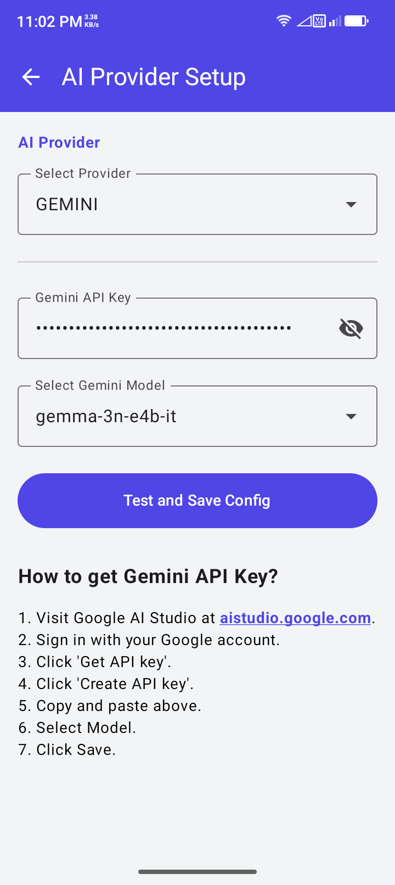
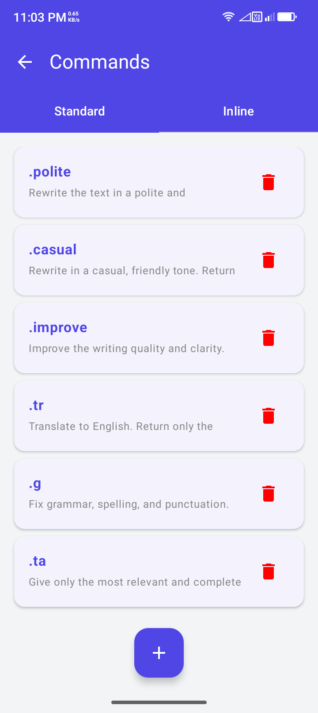
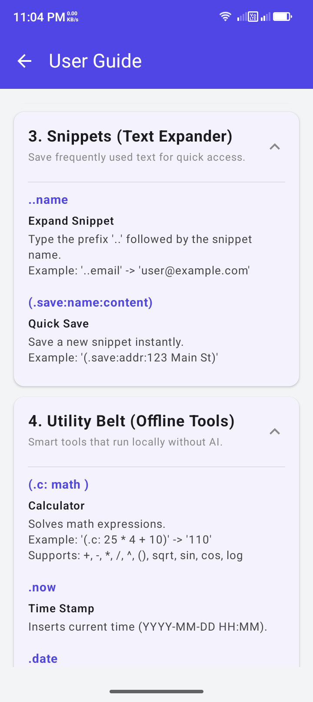
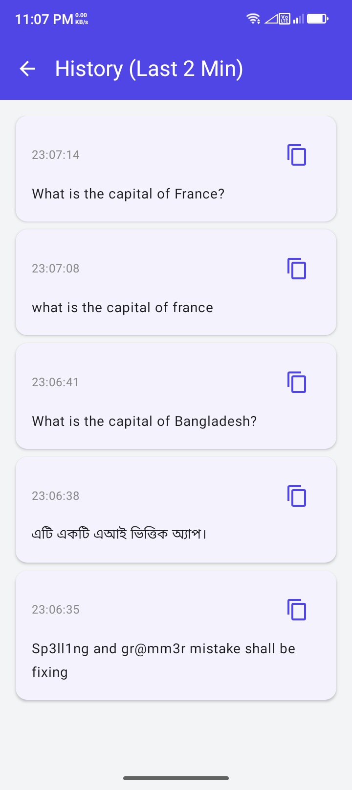

# TypeAssist 🚀

  

  <b>Intelligent AI-Powered Keyboard Assistant for Android</b>

  
  
  

TypeAssist is a powerful Android Accessibility Service that acts as an intelligent layer over your existing keyboard. It integrates cutting-edge AI (Google Gemini, Cloudflare Workers AI) and a suite of offline utility tools directly into any text input field on your device. 

No more switching apps to fix grammar, translate text, or calculate math. TypeAssist is always just a trigger away.

---

## 📸 Screenshots

  
  
  

  
  
  

---

## ✨ Features

### 🤖 AI Capabilities
*   **Ask AI:** Query Google Gemini or Cloudflare Workers AI directly from any app.
*   **Grammar Fix:** Instantly correct spelling, punctuation, and grammar errors.
*   **Translation:** Translate text from any language to English (or your preferred language).
*   **Tone Adjustment:** Rewrite messages to be more professional, polite, or friendly.
*   **Inline Commands:** Embed AI queries within sentences using `(.ta: your prompt)`.

### 🛠 Utility Belt (Offline Tools)
*   **Smart Calculator:** Solve math expressions in-place.
    *   Example: `(.c: 25 * 4 + 10)` -> `110`
*   **Snippets (Text Expander):** Expand shortcuts into full text blocks.
    *   Example: `..email` -> `user@example.com`
*   **Date & Time:** Insert current timestamps with `.now` or `.date`.
*   **Password Generator:** Generate strong random passwords on the fly with `.pass`.

### 🛡 Safety & Privacy
*   **Global Undo:** Revert any action instantly using `.undo`.
*   **History Manager:** View and recover original text from the last 2 minutes.
*   **Privacy First:** Processes text **only** when a trigger is detected. No data is stored permanently.

---

## 📖 Usage Guide

### Standard Triggers
Type your text followed by a trigger to process it.

| Trigger | Action | Example |
| :--- | :--- | :--- |
| `.ta` | Ask AI | `Population of Tokyo? .ta` |
| `.g` | Fix Grammar | `i go home yestarday .g` |
| `.tr` | Translate | `你好世界 .tr` |
| `.polite` | Polite Tone | `Give me the money .polite` |
| `.undo` | Undo | Reverts the last replacement |

---

## 📥 Installation & Setup

1.  **Download:** Get the latest APK from the [Releases](https://github.com/estiaksoyeb/TypeAssist/releases) page.
2.  **Permissions:** Enable the **TypeAssist Accessibility Service** in your Android Settings.
3.  **API Key:** Open the app, go to **Settings**, and add your **Google Gemini** or **Cloudflare** API key.
4.  **Start Typing:** Open any app (WhatsApp, Notes, Chrome) and try a trigger!

---

## 🤝 Support Development

If TypeAssist helps you in your daily workflow, consider supporting the development! Since traditional payment methods like PayPal are unavailable in my region, I accept donations via Binance and Cryptocurrency.

**Preferred Method (Zero Fees):**
*   **Binance Pay ID:** `724197813`

**Other Cryptocurrencies:**
*   **USDT (TRC20):** `TPP5S7HdV4Hrrtp5Cjz7TNtttUAfZXJz5a`
*   **TRX (Tron):** `TPP5S7HdV4Hrrtp5Cjz7TNtttUAfZXJz5a`

*Every bit helps keep this project open-source and covers the maintenance costs.*

---

## 🛠 Tech Stack
*   **UI:** Jetpack Compose (Material 3)
*   **Language:** Kotlin
*   **Network:** OkHttp / Gson
*   **Service:** Android AccessibilityService

---

## 📜 License
Distributed under the **GPLv3 License**. See `LICENSE` for more information.

---

## 🔒 Privacy Note
TypeAssist uses an Accessibility Service to function. 
- It does **not** log your keystrokes.
- It does **not** send data to any server unless you explicitly use an AI trigger (`.ta`, `.g`, etc.).
- It is fully **Open Source**, so you can audit the code yourself for peace of mind.
